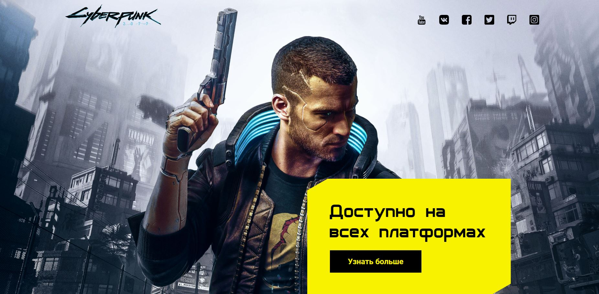
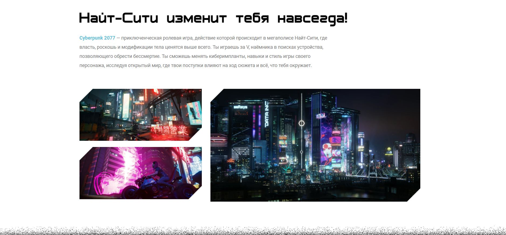
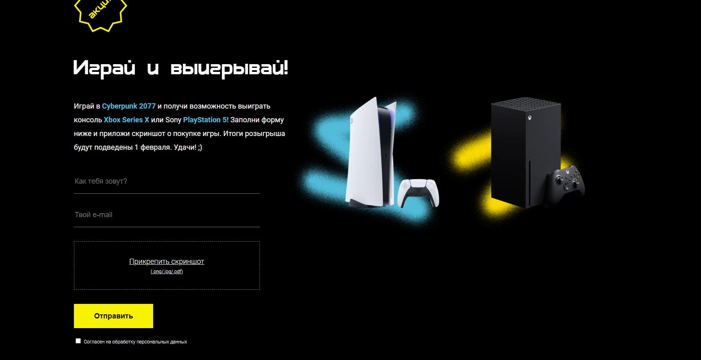
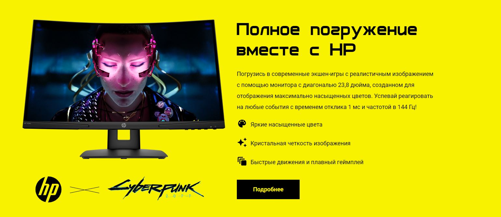
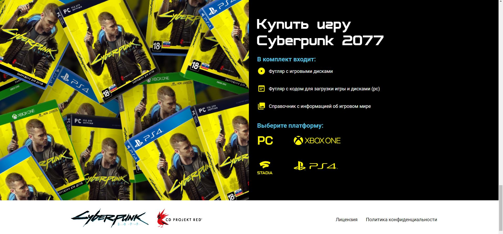
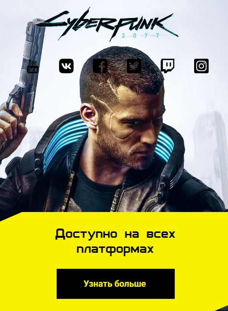

# CyberPunk

 
   
    
  

 <a href="https://sergeylif.github.io/projectCyberPunk/">Preview</a> &nbsp;&nbsp;&nbsp;|&nbsp;&nbsp;
  <a href="https://www.figma.com/file/cyOuCcxqhxwqCrillGbcFm/Cyberpunk?type=design&node-id=0-1&mode=design">Original design</a>&nbsp;&nbsp;&nbsp;|&nbsp;
   &nbsp;

